# KingsMove ♟️  

**A PvP Live Chess Web Application**

🌐 **[Live Demo](https://kingsmove-frontend.onrender.com)** | 🚀 **Play Now!**

KingsMove is a real-time, player-vs-player (PvP) web-based chess platform. It offers seamless matchmaking, friend challenges, user account management, and live gameplay—all crafted as a solo project.

---

## 🔧 Tech Stack

**Frontend:**
- React
- TailwindCSS
- Socket.io-client (for real-time gameplay)

**Backend:**
- Node.js
- Express
- Socket.IO
- MongoDB (via Mongoose)
- JWT Authentication (Access & Refresh Tokens)
- Cloudinary (for image storage)

---

## 🚀 Features

- 🔒 JWT-based Authentication (access & refresh tokens)
- 👤 Profile Management
  - Update user info
  - Reset password (with old password verification)
  - Delete account (with password verification)
- 🤝 Friend System
  - Send/accept friend requests via username
  - View friends list
  - Delete friend
- 🧠 Chess Gameplay
  - Challenge a friend to a match
  - Random matchmaking
  - Real-time game updates using Socket.IO
  - Only one active game at a time
  - Quit game functionality

---

## 🖼️ Screenshots

### 🔐 Login & Create Account  
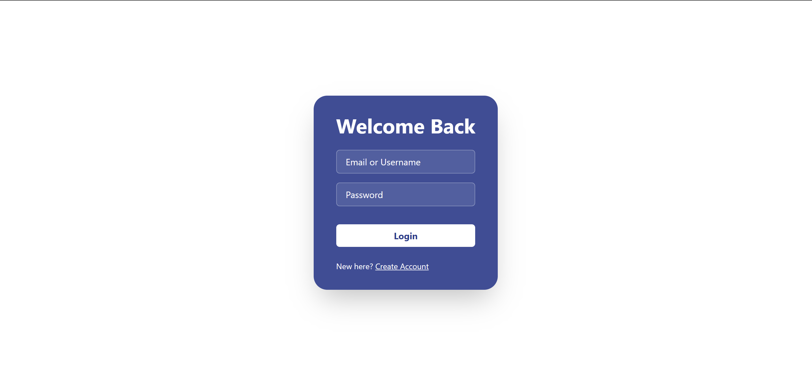  
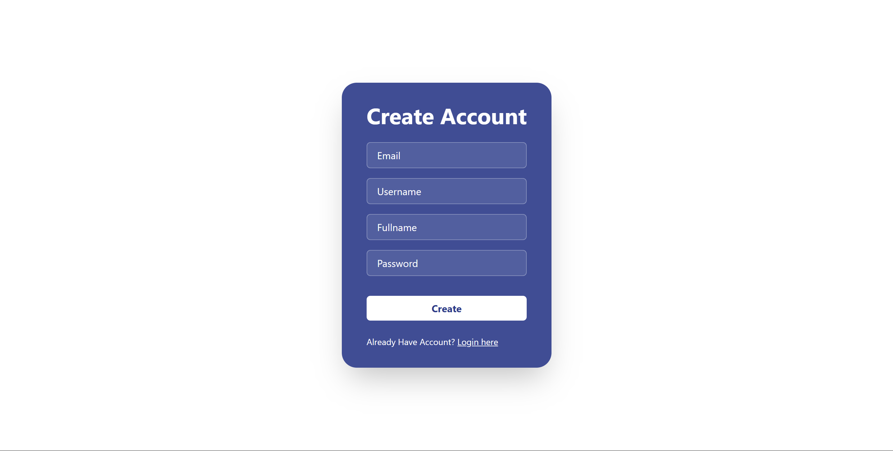

### 🏠 Home Page  
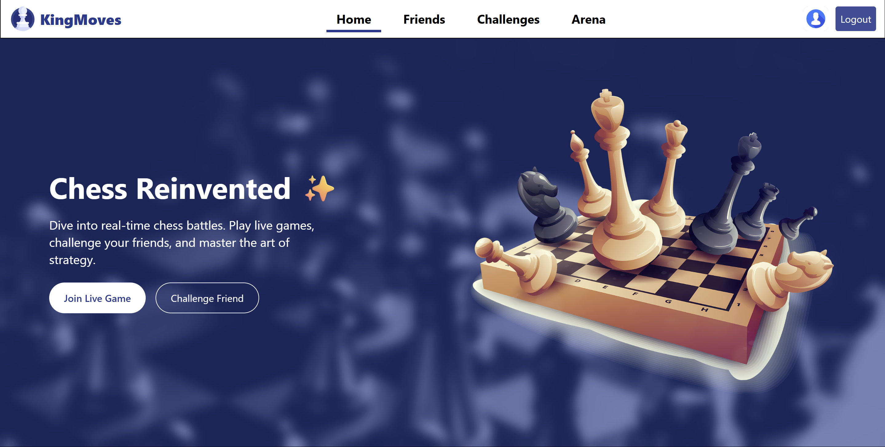

### 👥 Friends Page  
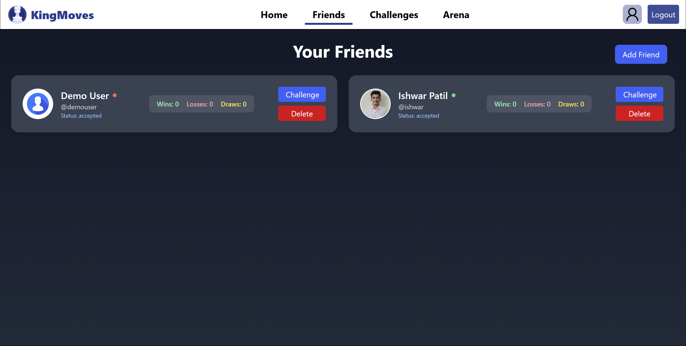

### 🎯 Challenges Page  
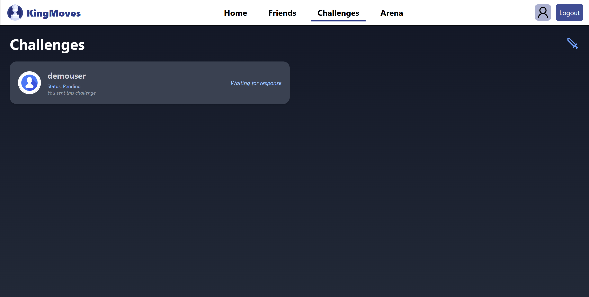

### ⚙️ Account Details  
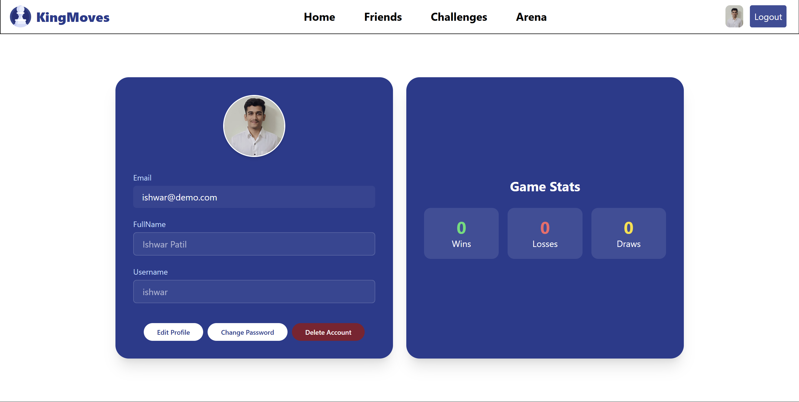

### 🔑 Password Change & Account Deletion  
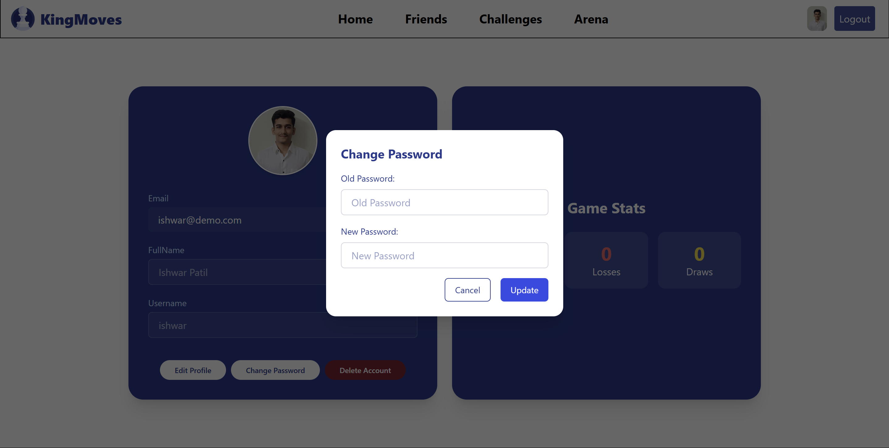  
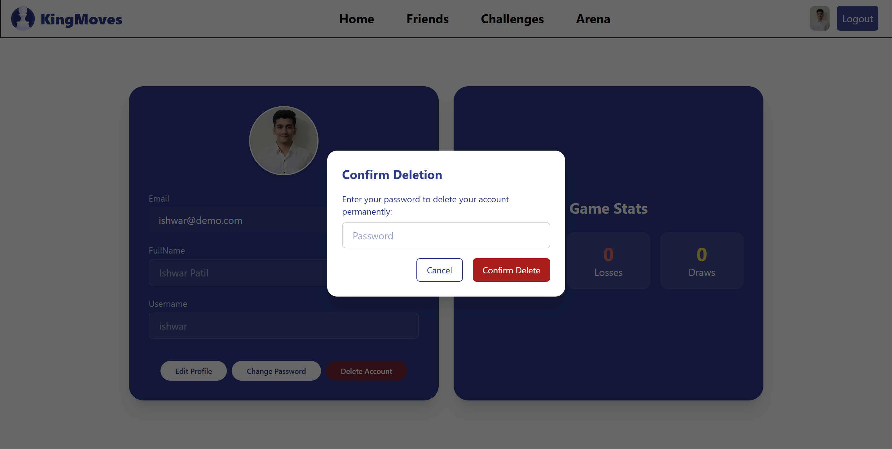

### ♟️ Find Game (Matchmaking)  
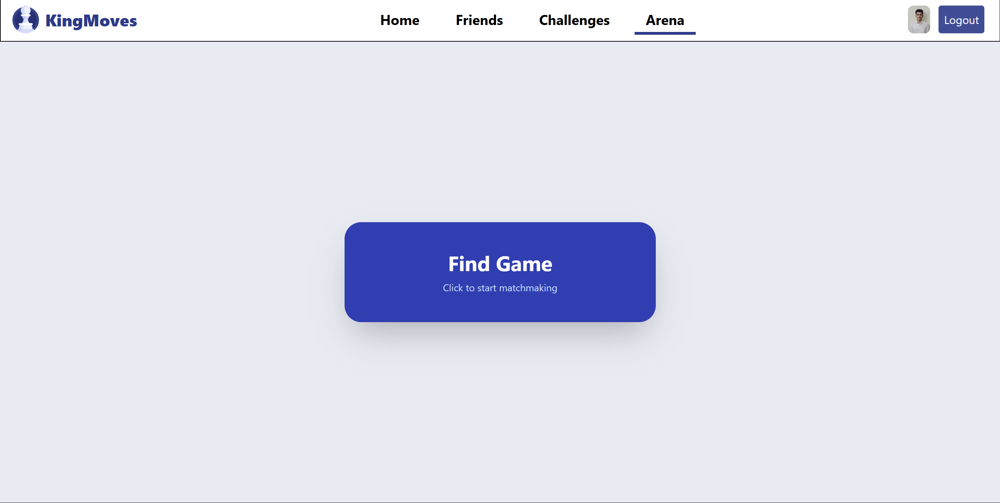

### ⏳ Ongoing Game  
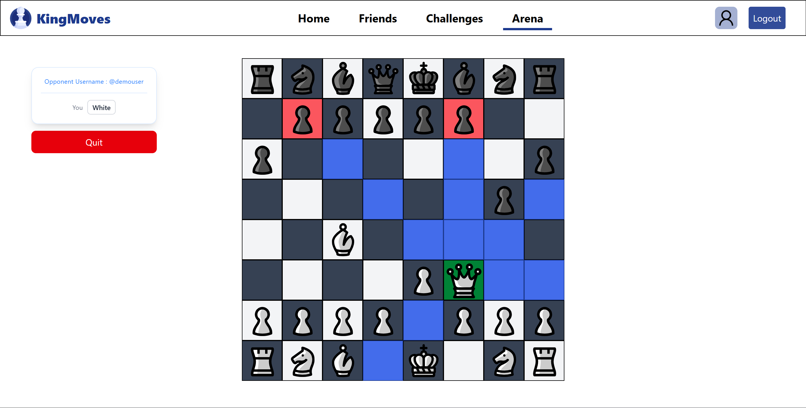

### ✅ Completed Game  
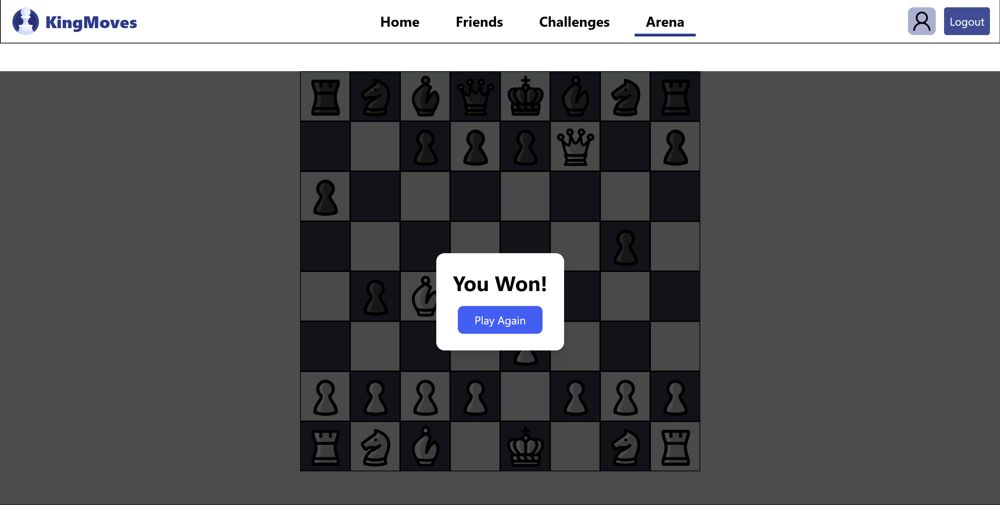


### 📱 Mobile Menu 
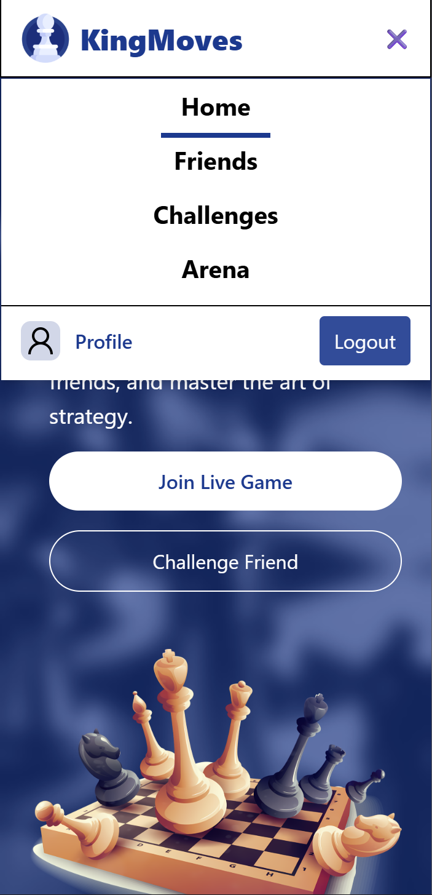

---

## 🛠️ Getting Started

### Prerequisites
- Node.js & npm
- MongoDB instance (local or cloud)
- Cloudinary account (for image uploads)

### 1. Clone the repository
```bash
git clone https://github.com/IshwarP32/KingsMove.git
cd KingsMove
```
### 2. Setup Environment Variables
➤ Frontend (KingsMove/frontend/.env)
```
VITE_BACKEND_URL = http://localhost:4000
SOCKET_URL = http://localhost:4001
```
➤ Backend (KingsMove/backend/.env)
```
MONGODB_URI=your_mongodb_connection_string

CLOUDINARY_CLOUD_NAME=your_cloudinary_cloud_name
CLOUDINARY_API_KEY=your_cloudinary_api_key
CLOUDINARY_API_SECRET=your_cloudinary_api_secret

ACCESS_TOKEN_SECRET=your_access_token_secret
ACCESS_TOKEN_EXPIRY=15m

REFRESH_TOKEN_SECRET=your_refresh_token_secret
REFRESH_TOKEN_EXPIRY=7d
```
### 3. Install dependancies
```bash
cd frontend
npm install

cd ../backend
npm install
```
### 4. Run developenedt servers in two separate terminals
```bash
cd frontend
npm run dev
```
```bash
cd backend
npm run dev
```
---

🤝 Acknowledgements
This project was designed, developed, and maintained solely by me as a learning and passion project.
Feel free to contribute or raise issues!
